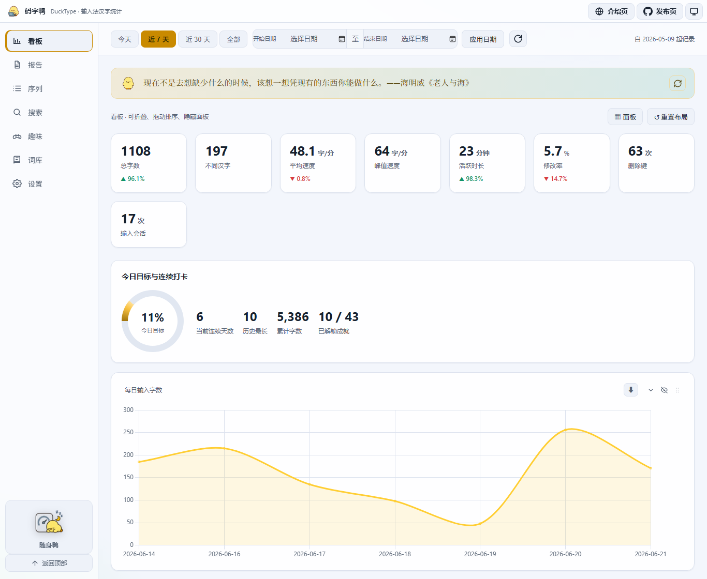
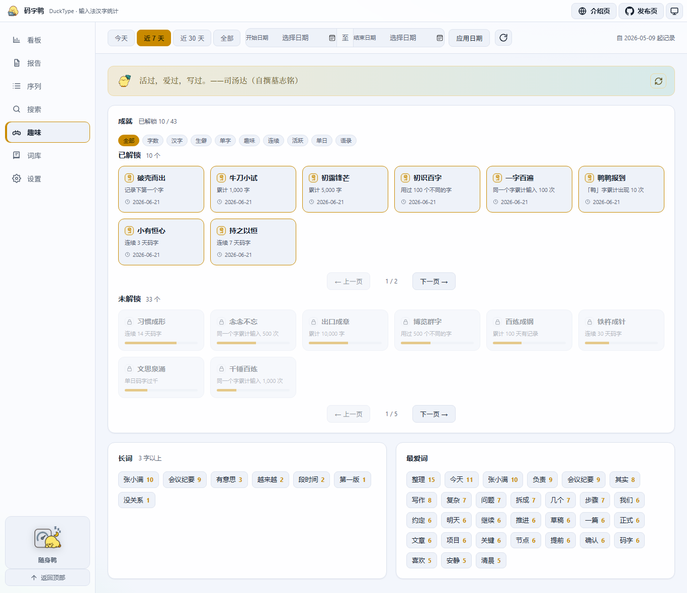
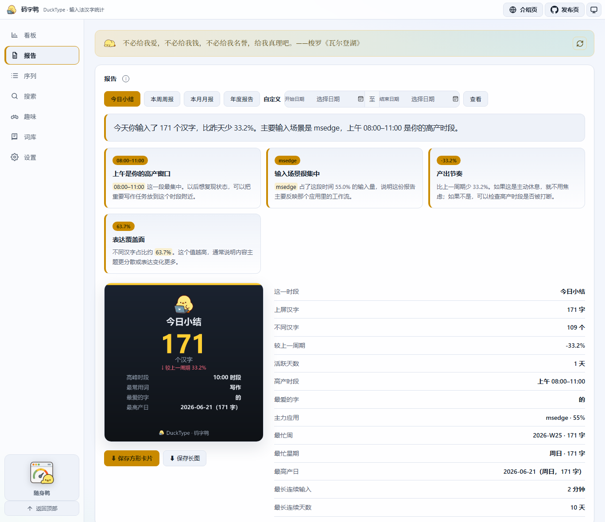
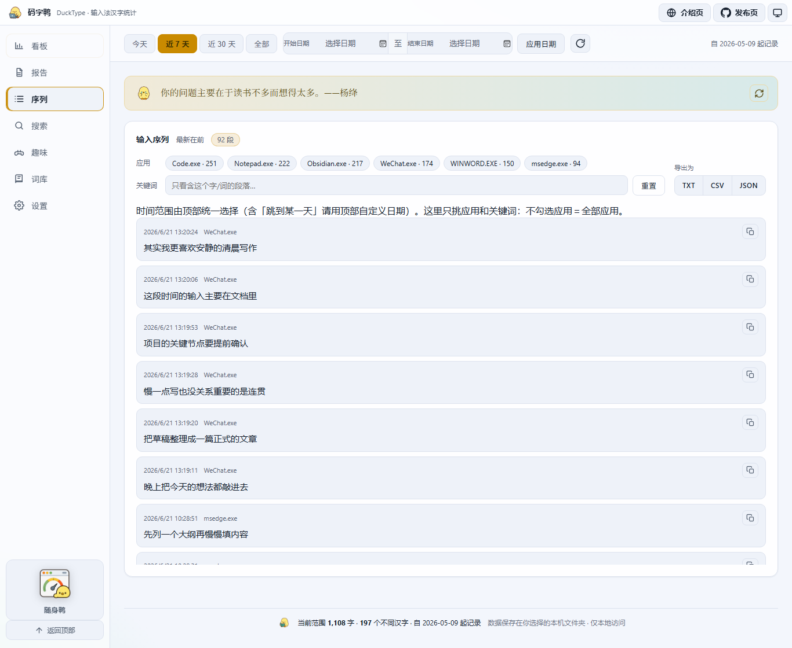
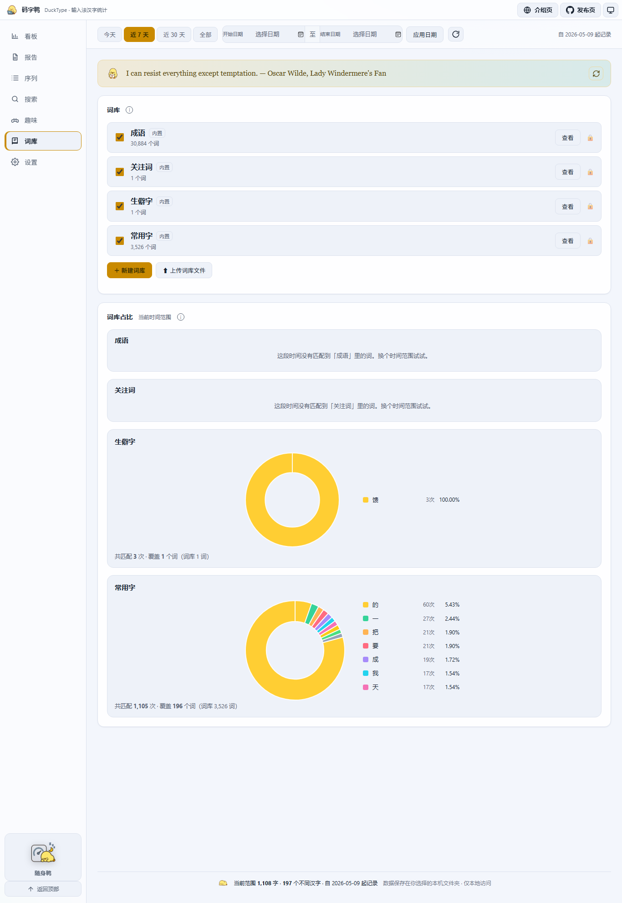
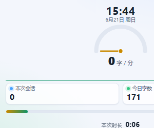

# DuckType · 码字鸭

<p align="center">
  
</p>

<p align="center">
  <strong>一只蹲在 Windows 后台、只数中文的码字小鸭。</strong><br>
  它不记你按了什么键，只看输入法最终上屏的汉字——于是你第一次能清楚看见：<br>
  我最近到底写了多少、在什么时候最顺、把字都敲进了哪些应用。
</p>

<p align="center">
  <a href="https://github.com/x1324x5/Duck-Type/actions/workflows/build.yml"></a>
  <a href="https://github.com/x1324x5/Duck-Type/releases"></a>
  <a href="LICENSE"></a>
  
</p>

<p align="center">
  
</p>

---

## 界面一览

<table>
  <tr>
    <td width="50%"><b>趣味 · 成就徽章与最爱词</b><br></td>
    <td width="50%"><b>报告 · 卡片化叙事</b><br></td>
  </tr>
  <tr>
    <td width="50%"><b>输入序列 · 真实上屏回放</b><br></td>
    <td width="50%"><b>词库占比 · 词语分布饼图</b><br></td>
  </tr>
</table>

<p align="center">
  
  <br><sub><b>随身鸭</b>：写作时悬浮置顶的轻量速度表</sub>
</p>

<sub>以上截图均为内置演示数据，非真实输入记录。</sub>

## 为什么会有这只鸭子

普通的打字统计工具数的是「按键」，可中文输入是一串拼音换来一个词——按了多少键，跟你真正写了多少字几乎没关系。市面上能数清「中文上屏量」的本地工具又意外地少。

DuckType 想做的事情很小：**安静地待在托盘里，只统计你通过输入法真正敲定的每一个汉字**，然后把这些数据整理成一个好看、能一眼扫过去的本地仪表盘。它不是监控软件，也不联网——拼音、英文、数字都不入库，大段粘贴会被自动忽略，所有记录都躺在你自己选的那个文件夹里。

适合长期用中文写东西的人：写论文的研究生、做内容的创作者、爱记笔记的人，以及任何偶尔会好奇「我这周到底码了多少字」的人。

## 打开它你会看到什么

**一块仪表盘，而不是一张报表。** 首屏先给你最关心的几个数字——总字数、平均与峰值速度、活跃时长、修改率——再往下是今日目标环、每日产出曲线、按小时的输入节奏，以及高频字、高频词、词性分布和一张「星期 × 小时」的活跃热力图。点任意一个字或词，都能跳进去看它的来龙去脉。

**报告，会替你把数字翻译成人话。** 今日 / 周 / 月 / 年都有一段自然语言小结，配上「行为洞察」卡片：你的高产窗口落在几点、产出比上一周期涨了还是跌了、是不是改得有点多。每份报告都能存成一张分享用的方形 PNG 卡片，或一张包含每日趋势、洞察、高频词与各应用分布的「长图」，更适合做周报或年度回顾。

**关注词，盯住分词器盯不住的东西。** 人名、项目代号、自己的口头禅——这些词 jieba 之类的分词工具往往切不准，于是从来不会出现在词频榜里。把它们加进「关注词」，DuckType 就直接在上屏序列里逐字精确数：出现了多少次、最近一次什么时候、横跨了几天、最常出现在哪个应用，还能按分组归类，并看到每个词的趋势曲线与环比。它们同时会被教给分词器，于是也能正常出现在高频词、词性和主题里。每张卡片跟着顶部时间范围实时刷新，点开就是完整的时段与上下文分布。

**输入序列，是你自己的写作回放。** 真正上屏的中文片段按时间线倒序铺开。日期统一交给顶部时间范围，页内则可以多选要看的应用、按关键词只看含某字 / 词的段落，一个「重置筛选」随手还原；单段可一键复制，也能整段导出成 TXT / CSV / JSON——回看、归档、二次分析都行。

**词库，看看你最常写的是哪一类词。** 「词库」栏内置一份约 3 万条的成语词典，会在你的上屏序列里逐段匹配，用饼图展示这段时间各成语的出现占比，点扇区就跳到搜索看详情。你也可以上传现成词库文件（自动适配常见的「词 + 频次」格式），或粘贴 / 逐条新建自己的词库，每个词库都能单独启用停用。词库统计是额外的观察层，**不会影响看板的字数与词频**。

**随身鸭，写作时只留一个轻量计数器。** 不想开整块看板时，点开「随身鸭」——一个始终置顶的悬浮小窗，用一只无刻度仪表盘的指针实时显示码字速度，配一条近一分钟的速度曲线、本次会话字数、今日字数与目标进度，顶部还有实时时钟、底部显示本次随身鸭已经开了多久。可全局热键一键开关（设置页自定义）。看板还有「仪表盘使用历史」记录你打开看板 / 随身鸭的足迹，以及「对比报告」把任意两个时段并排比较。

**还有一点点不正经。** 连续打卡、每日目标、成就徽章、最爱词、长词、生僻字、只敲过一次的字……让一个统计工具不至于太严肃。看板顶部还有一句会定时换的语录陪你写字。

亮色 / 暗色 / 跟随系统，三种主题随手切换并记住。

## 它怎么做到「只数中文」

普通的全局键盘钩子只能看到按键，拿不到输入法最终提交的汉字。DuckType 用一个原生的 `WH_GETMESSAGE` 钩子 DLL 注入到 GUI 进程里，直接观察文本提交事件，再把字符回传给 Python 主程序：

- 现代程序（微信、VS Code、浏览器、Office、Win11 记事本等）走 TSF 文本服务框架；
- 经典 Win32 输入框走 `WM_CHAR` / `WM_IME_CHAR`；
- 两条通路互斥，同一段文本不会被数两遍；
- 单次插入超过约 30 个汉字会被当作粘贴，不计入。

也有它做不到的地方，说在前面：目前只支持 Windows；默认 64 位版本主要捕获 64 位程序；极少数完全自绘、既不走 TSF 也不走 `WM_CHAR` 的输入框可能会漏记。

## 隐私这件事

DuckType 默认只在本机保存三类数据：每个上屏汉字（含时间戳与当时的应用名）、少量退格 / Delete 编辑键事件（用来估算修改率）、以及语录浏览次数的哈希（用于相关成就）。

它**不上传任何数据，也不保存拼音、英文、数字或普通快捷键**。默认会跳过 Win32 能识别的密码框，并内置常见密码管理器黑名单。需要注意的是，浏览器、Electron 或完全自绘的密码区域不一定能被系统识别为密码框——遇到敏感应用，建议直接把它加进黑名单。

## 快速开始

### 下载即用

到 [Releases](https://github.com/x1324x5/Duck-Type/releases) 下载 `DuckType.exe`。第一次启动会让你选一个数据文件夹，之后小鸭就常驻系统托盘。关掉仪表盘窗口只是收进托盘，统计照常进行；想彻底退出，从托盘菜单选退出。

还没有积累数据时，看板会提示「加载演示数据」——用一份示例数据先看看 DuckType 能展示什么，它不会改动你的真实记录，退出即恢复。

### 从源码运行

```bat
conda create -n ducktype python=3.11
conda activate ducktype
python -m pip install -r requirements.txt
cmd /c native\build_dll.bat
python tools\make_icon.py
python -m ducktype
```

`native\build_dll.bat` 需要 MinGW-w64 或 MSVC。没编译这个 DLL 时仪表盘照样能打开，只是不会记录上屏汉字。

也支持纯命令行：

```bat
python -m ducktype                 :: 托盘 + 原生仪表盘
python -m ducktype --report        :: 打印文本摘要
python -m ducktype --report --range 7d
python -m ducktype --export out\   :: 导出字频、词频、输入序列
python -m ducktype --clear         :: 清空全部记录
```

## 配置与数据

绝大多数设置都在仪表盘的「设置」页：每日目标、暂停统计、程序黑名单、跳过密码框、分段 / 会话间隔、数据保留天数、界面主题、开机自启等。改完即时保存。

运行期文件放在你选择的「数据根目录」里（源码运行默认回退到 `%APPDATA%\DuckType\`，也可用环境变量 `DUCKTYPE_DATA_DIR` 覆盖）：`ducktype.db` 是 SQLite 数据库，`config.json` 是配置，`phrases.txt` 可自定义看板语录，`ducktype.log` 记录运行与捕获诊断。固定留在 `%APPDATA%\DuckType\location.json` 的只有一个指针，用来下次启动找到你选的位置。想换电脑或换盘？设置页的「数据管理」可以整体迁移数据根目录，也可以把全部数据（数据库 + 配置）导出成一个 `.duckpack` 备份文件，再在另一台机器上导入覆盖——整库搬家。

## 开发与测试

```bat
python -m pip install -r requirements.txt pytest pyinstaller
python -m pytest -q
```

改动捕获相关代码后，请在 Windows 真机上验证一次：编译 DLL → 启动 DuckType → 在微信 / VS Code / 记事本里用输入法打中文 → 确认「序列」出现汉字 → 退出后确认宿主应用没有 TSF/MSCTF 相关崩溃。

打包：

```bat
cmd /c native\build_dll.bat
python tools\make_icon.py
python -m PyInstaller --noconfirm ducktype.spec
```

产物在 `dist\DuckType.exe`。

## 许可证

[MIT](LICENSE)。请只用 DuckType 统计你自己的输入。
